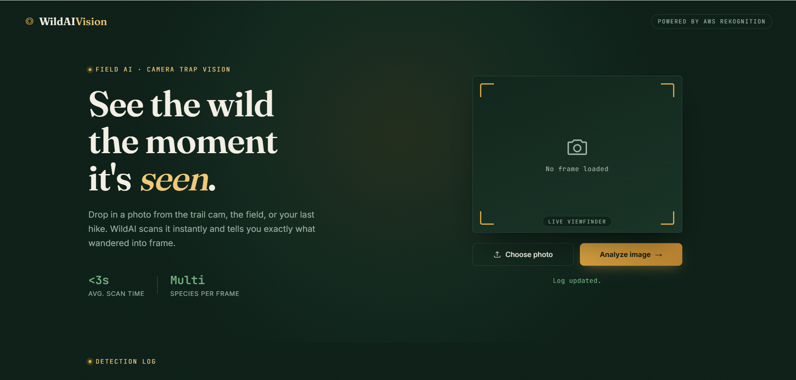
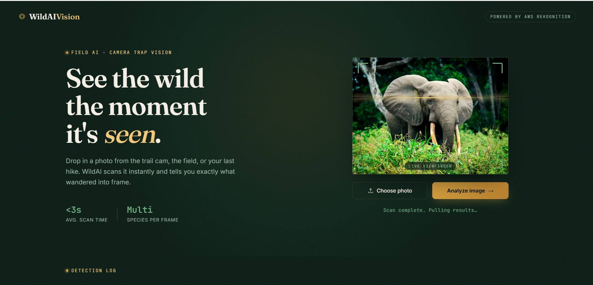
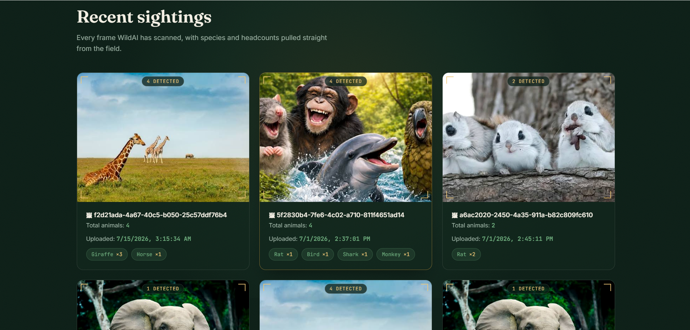
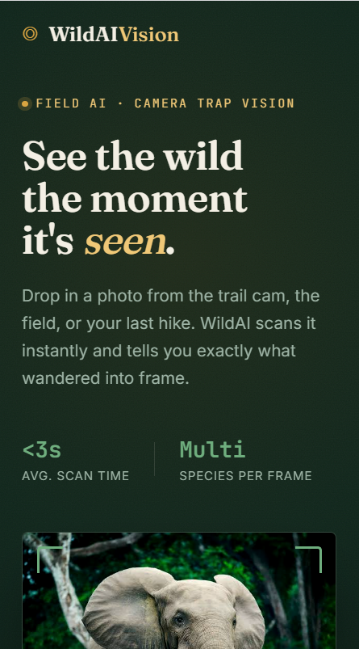

<div align="center">

# 🦁 WildAI Vision - Animal Detection System

### AI-Powered Animal Detection using AWS Serverless Architecture

<p align="center">


</p>

AI-powered web application that detects animals from uploaded images using a serverless AWS backend.

</div>

---

# 📸 Project Preview

## 🏠 Home Page



---

## 📤 Upload Animal Image



---

## 🔍 Detection Result



---

# ✨ Features

- 🦁 AI-powered animal detection
- 📷 Image upload and preview
- ⚡ Fast prediction using AWS Lambda
- ☁️ Amazon S3 image storage
- 🌐 REST API powered by Amazon API Gateway
- 🎯 Detection confidence score
- 📱 Responsive user interface
- 🚀 Frontend hosted on Amazon EC2
- 🔄 Automatic deployment with GitHub Actions
- 🎨 Modern glassmorphism UI

---

# 🏗 System Architecture

```text
                     User
                       │
                       ▼
          HTML • CSS • JavaScript
                       │
                       ▼
             Amazon API Gateway
                       │
                       ▼
                AWS Lambda Function
                       │
                       ▼
                 Amazon S3 Storage
                       │
                       ▼
              Animal Detection Model
                       │
                       ▼
        Animal Name + Confidence Score
                       │
                       ▼
              Display Detection Result
```

---

# 🛠 Tech Stack

## Frontend

- HTML5
- CSS3
- JavaScript

## Backend

- AWS Lambda
- Amazon API Gateway

## AWS Services

- Amazon S3
- Amazon EC2

## Web Server

- Nginx

## DevOps

- Git
- GitHub
- GitHub Actions

---

# 📂 Project Structure

```text
WildAIVision-the_animal_detection_system
│
├── index.html
├── style.css
├── script.js
├── README.md
│
├── screenshots
│   ├── home.png
│   ├── upload.png
│   ├── result.png
│   └── mobile.png
│
└── assets
```

---

# 🚀 Getting Started

## Clone Repository

```bash
git clone https://github.com/Jagruti345/WildAIVision-the_animal_detection_system.git
```

## Open Project

```bash
cd WildAIVision-the_animal_detection_system
```

## Run

Open

```text
index.html
```

in your browser.

---

# ☁️ Deployment

### Frontend

- Amazon EC2
- Nginx

### Backend

- AWS Lambda
- Amazon API Gateway

### CI/CD

Every push to the **main** branch automatically deploys the latest frontend to the EC2 instance using GitHub Actions.

---

# 📷 Screenshots

| Home Page | Upload |
|-----------|--------|
|  |  |

| Detection Result | Mobile View |
|------------------|-------------|
|  |  |

---

# 🎯 Future Improvements

- Support for multiple animal detection
- Animal information panel
- Detection history
- Offline mode
- Dark mode
- Real-time camera detection
- Voice assistance
- Location-based wildlife information

---

# 👩‍💻 Author

**Jagruti Patil**

🎓 Computer Engineering Student

☁️ AWS Cloud & Full Stack Developer

🔗 GitHub: https://github.com/Jagruti345

---

# ⭐ Show Your Support

If you like this project,

⭐ Star this repository

🍴 Fork this repository

🤝 Contribute to improve the project
